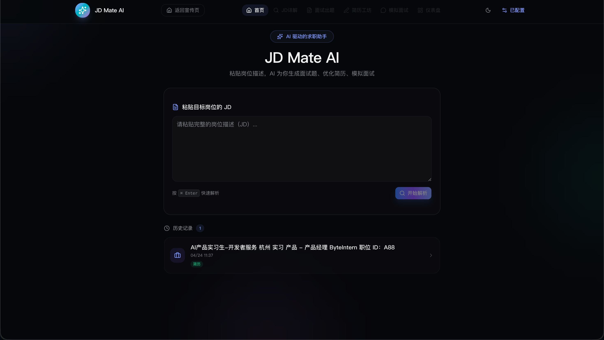
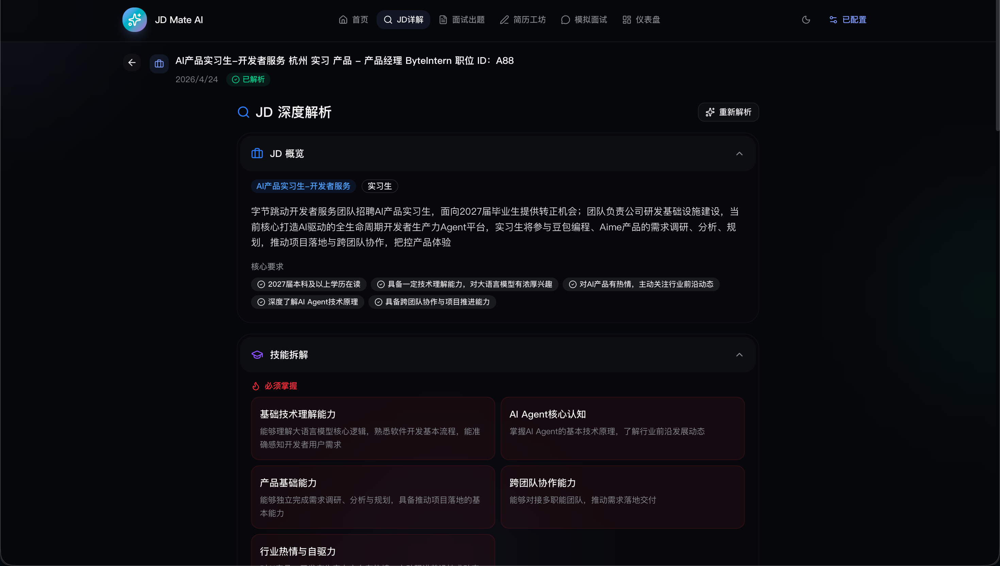
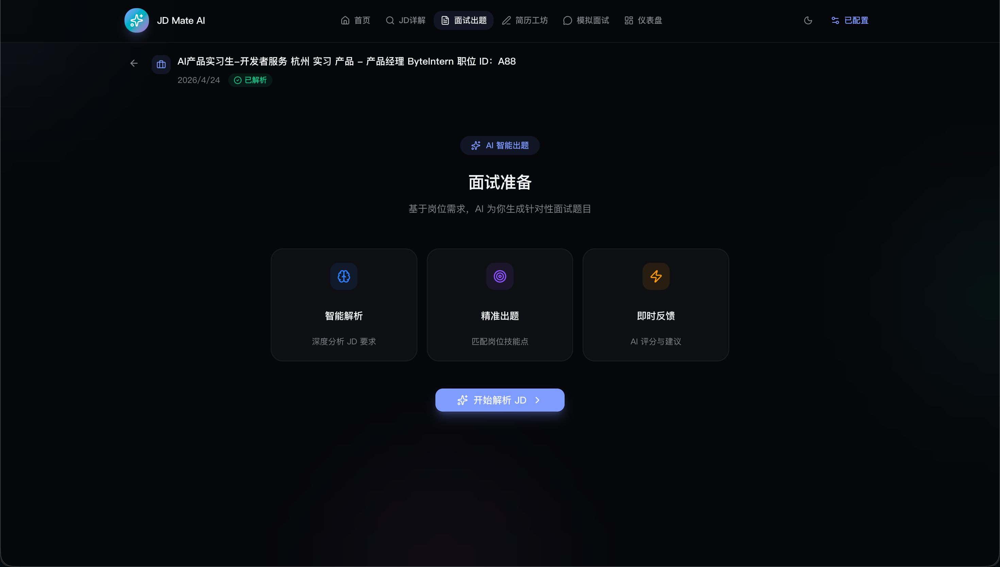
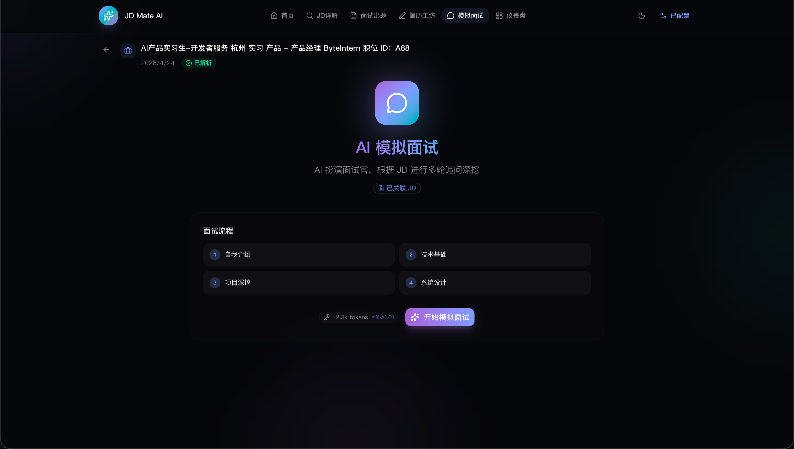
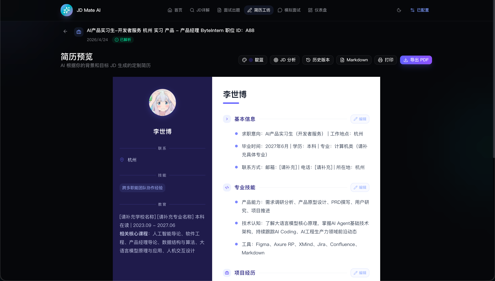
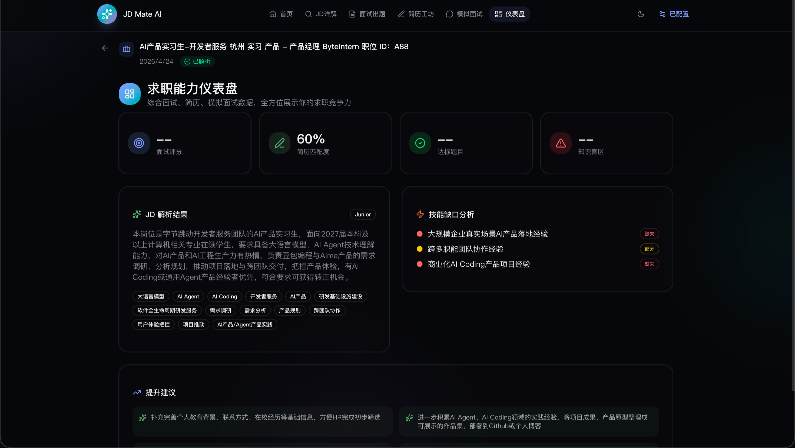
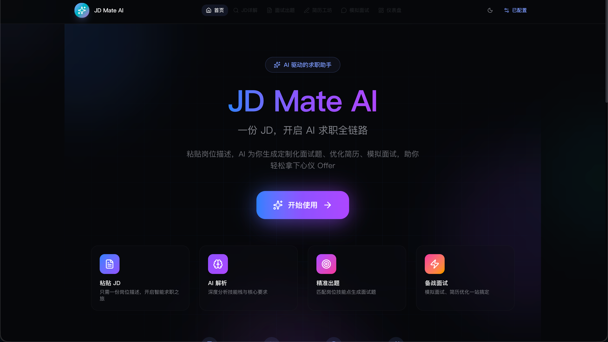

<div align="center">

# JD Mate AI

🤖 **AI 驱动的面试准备平台**

粘贴任意 JD（岗位描述），智能生成面试题、优化简历、模拟面试、深度分析报告

[](LICENSE)
[](https://nextjs.org/)
[](https://sdk.vercel.ai/)
[](https://tailwindcss.com/)
[](https://github.com/boshi-xixixi/jd-mate-ai/stargazers)

[功能特性](#-功能特性) · [快速开始](#-快速开始) · [部署](#-部署) · [截图](#-截图) · [技术栈](#️-技术栈) · [贡献指南](#-贡献指南) · [English](README.en.md)

</div>

---

## ✨ 功能特性

| 功能 | 说明 |
|---|---|
| 📋 **JD 深度分析** | AI 深度解析岗位描述——挖掘隐性要求、解读企业黑话、评估竞争力、生成个性化学习路径 |
| ❓ **智能出题** | 每个 JD 精心生成 9 道面试题，从基础到进阶，按难度分级，覆盖核心考点 |
| 📄 **简历工坊** | AI 用 STAR 法则重写简历，评分 JD 匹配度，标注改进方向，支持多版本对比 |
| 🎯 **模拟面试** | AI 面试官多轮追问，根据你的回答自适应追问，模拟真实面试场景 |
| 📊 **仪表盘** | 雷达图可视化能力维度，追踪答题进度，定位知识盲区 |
| 📝 **面试报告** | 模拟面试后生成结构化复盘报告，含维度评分、亮点和改进建议 |

---

## 🔄 使用流程

```
输入 JD  →  AI 深度解析  →  选择功能模块
                              │
            ┌─────────────────┼─────────────────┐
            ▼                 ▼                 ▼
        智能出题          简历工坊          模拟面试
      生成 9 道题       STAR 重写简历      AI 多轮追问
      在线答题评分      JD 匹配度评分      生成复盘报告
```

---

## 🚀 快速开始

### 环境要求

- **Node.js** ≥ 18
- **pnpm** ≥ 8（或 npm / yarn）

### 安装

```bash
# 克隆仓库
git clone https://github.com/boshi-xixixi/jd-mate-ai.git
cd jd-mate-ai

# 安装依赖
pnpm install

# 配置环境变量
cp .env.example .env.local
# 编辑 .env.local，填入你的 LLM API 信息（见下方说明）

# 启动开发服务器
pnpm dev
```

浏览器打开 [http://localhost:3000](http://localhost:3000) 即可使用。

### 配置说明

JD Mate 支持所有兼容 OpenAI 格式的 LLM 提供商，提供 **两种配置方式**：

#### 方式一：页面内配置（推荐）

启动后点击页面右上角 ⚙️ **模型设置** 按钮，即可在界面中完成配置：

- 🏷️ **服务商预设**：一键选择 OpenAI / DeepSeek / 火山引擎 / 阿里通义 / 智谱 GLM / 自定义
- 🔑 **API Key**：输入你的密钥，支持显示/隐藏切换
- 🌐 **Base URL**：自动填充或手动输入
- 🤖 **模型名称**：自动推荐默认模型
- ✅ **连接测试**：一键验证配置是否正确
- 💾 **数据导入/导出**：备份和迁移你的所有数据

> 💡 页面内配置保存在浏览器 localStorage 中，无需修改任何文件即可使用。

#### 方式二：环境变量配置

适用于部署场景（Vercel / Docker 等），在 `.env.local` 中配置：

| 变量 | 说明 | 示例 |
|---|---|---|
| `LLM_BASE_URL` | API 端点地址 | `https://dashscope.aliyuncs.com/compatible-mode/v1` |
| `LLM_API_KEY` | 你的 API Key | `sk-xxxxx` |
| `LLM_MODEL` | 模型名称 | `qwen-plus` |

> ⚠️ 页面内配置优先级高于环境变量。如果用户在页面中配置了自己的 API Key，将使用页面配置。

**支持的 LLM 提供商**（任何 OpenAI 兼容 API 均可）：

| 提供商 | Base URL 示例 |
|---|---|
| OpenAI / Azure OpenAI | `https://api.openai.com/v1` |
| 阿里云百炼 / DashScope | `https://dashscope.aliyuncs.com/compatible-mode/v1` |
| 火山引擎 / 豆包 | `https://ark.cn-beijing.volces.com/api/v3` |
| 智谱 AI / GLM | `https://open.bigmodel.cn/api/paas/v4` |
| Moonshot / Kimi | `https://api.moonshot.cn/v1` |
| DeepSeek | `https://api.deepseek.com/v1` |
| Google Gemini（兼容网关） | 需搭配兼容网关 |
| 自部署：vLLM / Ollama / llama.cpp | 本地地址 |

---

## 📸 截图

<table align="center">
  <tr>
    <td align="center">
      <b>首页</b><br/>
      
    </td>
    <td align="center">
      <b>JD 深度分析</b><br/>
      
    </td>
  </tr>
  <tr>
    <td align="center">
      <b>面试出题</b><br/>
      
    </td>
    <td align="center">
      <b>模拟面试</b><br/>
      
    </td>
  </tr>
  <tr>
    <td align="center">
      <b>简历工坊</b><br/>
      
    </td>
    <td align="center">
      <b>仪表盘</b><br/>
      
    </td>
  </tr>
</table>

<p align="center">
  
</p>

---

## 🏗️ 项目结构

```
├── src/
│   ├── app/              # Next.js App Router
│   │   ├── api/          # 后端 API 路由
│   │   │   ├── analyze-jd/      # JD 深度分析
│   │   │   ├── chat/            # 流式对话
│   │   │   ├── evaluate/        # 答案评估
│   │   │   ├── interview-report/ # 面试报告
│   │   │   ├── parse/           # JD 解析
│   │   │   ├── generate-resume/ # 简历生成
│   │   │   └── ...
│   ├── components/       # React 组件
│   │   ├── jd-analysis.tsx      # JD 分析页
│   │   ├── mock-interview.tsx   # 模拟面试
│   │   ├── resume-builder.tsx   # 简历工坊
│   │   ├── resume-preview.tsx   # 简历预览
│   │   ├── dashboard.tsx        # 仪表盘
│   │   └── ...
│   └── lib/              # 工具库
│       ├── api.ts               # API 客户端
│       ├── llm.ts               # LLM 抽象层
│       ├── prompts.ts           # AI 提示词
│       ├── store.ts             # Zustand 状态管理
│       └── types.ts             # TypeScript 类型定义
```

## 🛠️ 技术栈

| 层级 | 技术 |
|---|---|
| **前端框架** | Next.js 16, React 19, TypeScript |
| **样式方案** | Tailwind CSS 4, shadcn/ui, Framer Motion |
| **状态管理** | Zustand + localStorage 持久化 |
| **AI 集成** | Vercel AI SDK (`ai`), OpenAI 兼容 SDK |
| **图表可视化** | Recharts（雷达图） |
| **PDF 导出** | jsPDF + html2canvas |

## 🌐 部署

### Vercel（推荐）

[](https://vercel.com/new/clone?repository-url=https://github.com/boshi-xixixi/jd-mate-ai)

1. 将你的 Fork 仓库导入 Vercel
2. 在 Vercel 控制台添加环境变量：`LLM_BASE_URL`、`LLM_API_KEY`、`LLM_MODEL`
3. 一键部署！

### Docker

```bash
docker build -t jd-mate-ai .
docker run -p 3000:3000 \
  -e LLM_BASE_URL=https://api.openai.com/v1 \
  -e LLM_API_KEY=sk-xxxxx \
  -e LLM_MODEL=gpt-4o-mini \
  jd-mate-ai
```

### 自部署（Node.js）

```bash
pnpm build
LLM_BASE_URL=... LLM_API_KEY=... LLM_MODEL=... pnpm start
```

## 🤝 贡献指南

欢迎各种形式的贡献！请查看 [CONTRIBUTING.md](CONTRIBUTING.md) 了解详情。

**适合新手的 Issue：**
- [ ] 添加更多简历模板
- [ ] 改进 JD 分析提示词
- [ ] 添加国际化（i18n）支持
- [ ] 编写单元测试
- [ ] 改进移动端适配

## 📄 开源协议

本项目基于 **MIT 协议** 开源——详见 [LICENSE](LICENSE) 文件。

简单来说：你可以自由使用、修改、分发、商用，只需保留原始版权声明即可。

## 🙏 致谢

- [Vercel AI SDK](https://sdk.vercel.ai/) — 流式 AI 集成
- [shadcn/ui](https://ui.shadcn.com/) — 精美组件库
- [Framer Motion](https://www.framer.com/motion/) — 流畅动画
- [Lucide](https://lucide.dev/) — 图标库

---

<div align="center">
用 ❤️ 为每一位求职者打造
</div>
